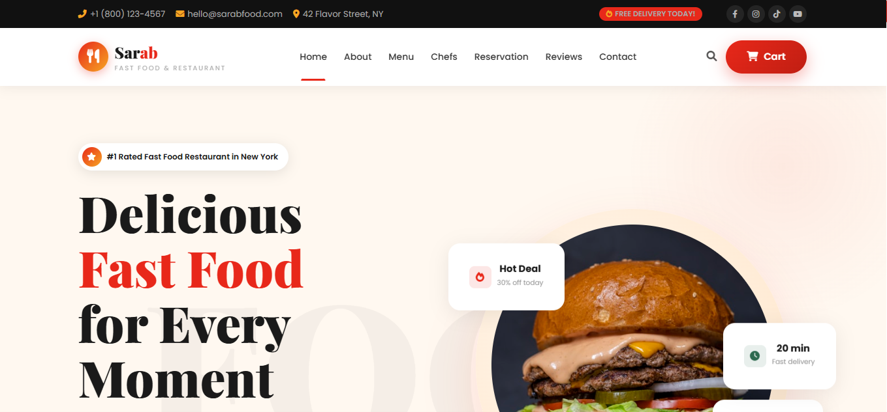

# 🍔 Restaurant E-Commerce Website

A responsive restaurant e-commerce website built with **React.js** and modern frontend technologies.  
The project provides an interactive food ordering experience with menu filtering, product details, shopping cart functionality, search, reservations, and responsive UI.

## 🌐 Live Demo

[View Live Website](https://Kashish-webdev-bca.github.io/e-commerce-website/)

## 📌 About The Project

This project is a frontend-focused restaurant e-commerce website designed to provide users with a smooth and interactive food browsing and ordering experience.

Users can explore different food categories, view detailed information about menu items, select quantities, add products to the shopping cart, and manage their cart items.

The website also includes interactive sections such as a gallery, reservation form, contact form, testimonials, and newsletter subscription UI.

## 📌 Purpose of the Project

The purpose of this project is to build a complete frontend restaurant e-commerce experience while practicing modern React development.

The project was created to strengthen practical skills in:

- React component architecture
- State management
- Props and event handling
- Conditional rendering
- Dynamic UI updates
- Responsive web design
- Form interactions
- Shopping cart functionality
- Git and GitHub workflow

## ✨ Features

- 🏠 Responsive restaurant homepage
- 🍔 Interactive food menu
- 🔍 Search overlay
- 🏷️ Food category filtering
- 📋 Detailed menu item popup
- ➕ Product quantity controls
- 🛒 Functional shopping cart
- ❤️ Add/remove favourite menu items
- 🖼️ Interactive image gallery
- ⬅️ Previous/Next gallery navigation
- 📅 Table reservation form
- 📩 Contact form
- 📱 Mobile responsive design
- 🎨 Interactive and modern UI
- 🔝 Smooth navigation and scrolling
- ⚡ React-based component architecture

## 📑 Website Sections

The website contains the following major sections:

### 🏠 Home Section
Introduces the restaurant with the main call-to-action and featured content.

### 📖 About Us
Provides information about the restaurant and its concept.

### 🍔 Menu
Displays available food items with categories, prices, ratings and other details.

### 👨‍🍳 Chefs
Introduces the restaurant's chefs and their information.

### 📅 Reservation
Allows users to submit a table reservation request.

### ⭐ Testimonials
Displays customer feedback and reviews.

### 📞 Contact Us
Contains restaurant contact information and an interactive contact form.

## 🛠️ Technologies Used

- **React.js**
- **JavaScript (ES6+)**
- **HTML5**
- **CSS3**
- **Bootstrap**
- **Vite**
- **Font Awesome**
- **Git & GitHub**

## 📁 Project Structure

e-commerce-website/
│
├── public/
│   ├── css/
│   ├── img/
│   ├── js/
│   └── webfonts/
│
├── src/
│   ├── components/
│   ├── App.jsx
│   ├── main.jsx
│
├── .github/
│   └── workflows/
│       └── deploy.yml
│
├── index.html
├── package.json
├── package-lock.json
├── vite.config.js
├── .gitignore
└── README.md

## 🔮 Future Improvements

- Backend & database integration
- User authentication
- Online payment integration
- Order tracking
- Admin dashboard

## 👩‍💻 Author

**Kashish Sharma**

* LinkedIn: https://www.linkedin.com/in/kashish-sharma-301974384

⭐ If you like this project, don't forget to star the repository!
